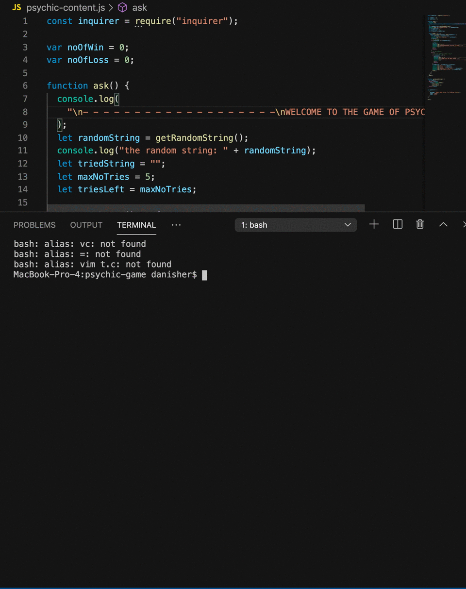

# psychic-game

:)

## Setup

```
The game is that the user will guess a String character and a tally will be given to the player in the WIN section if they guessed it right,and a tally in the LOSS section if they did not figured it out after a certain number of tries. For the game to work, it also requires:
1. The inquierer module to help in asking the question for every guess
2. A random String character generator
```

## Start

```
The game will start by asking the player what the generated character is. If the player put in the same value, a tally will be given to the player's Winning point, whilst if the they did not guessed it right after certain amount of tries, a tally will be put in place for the playre's Losing point. After these two actions the game will restart and a new random character will be generated.
```


